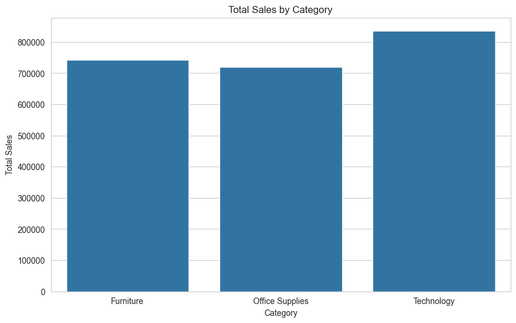
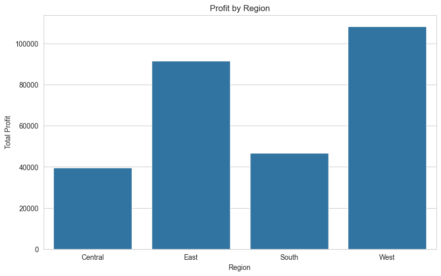
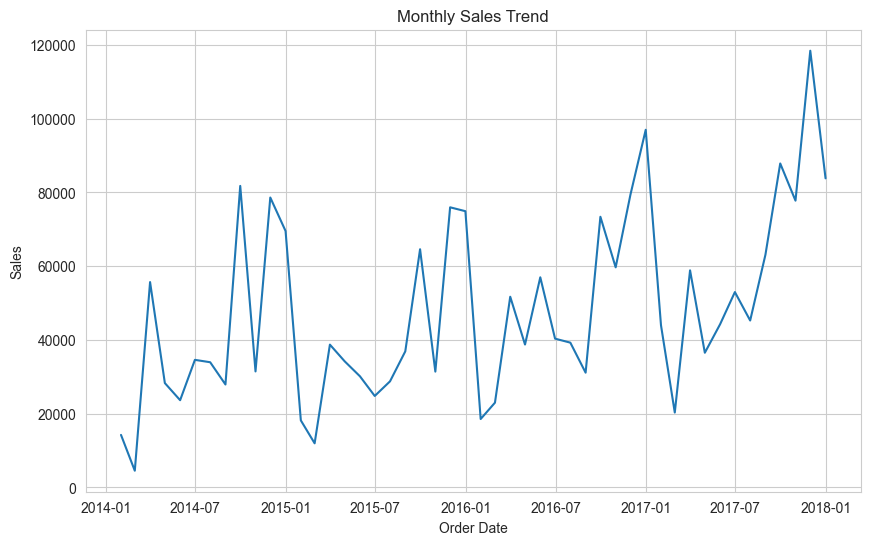
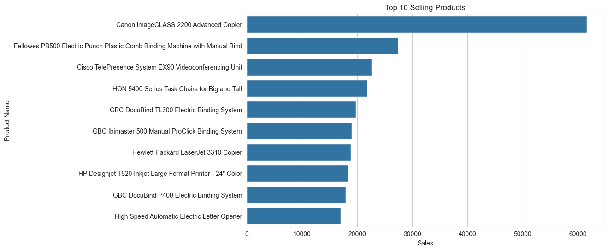
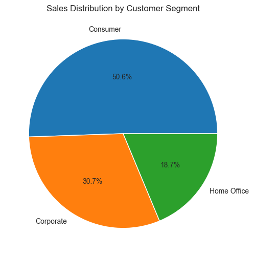

Data Visualization – Superstore Sales Dataset
---

Description
---

This project focuses on analyzing and visualizing real-world retail sales data using Python data visualization techniques.
The Superstore dataset is used to extract insights related to sales, profit, region performance, product trends, and customer segments.

The project demonstrates the complete pipeline of data loading → cleaning → analysis → visualization → insight generation.

Technologies Used
----
| Category | Tools |
|----------|------|
| Programming | Python |
| Data Handling | Pandas |
| Visualization | Matplotlib |
| Visualization | Seaborn |
| Environment | Jupyter Notebook |
| Version Control | Git & GitHub |

Features
---

* Data cleaning and preprocessing using Pandas
* Exploratory Data Analysis (EDA)
* Business insight extraction from dataset
* Creation of professional charts and graphs
* Saved visualizations for portfolio use

🎥 Demo Video
---

▶️ Watch the project demonstration here:

Repository Structure
---

```
DataVisualization_Project
│
├── DataVisualization_Project.ipynb   # Main notebook (EDA + Visualizations)
├── Sample - Superstore.csv           # Dataset used for analysis
├── images                            # Saved charts
│   ├── sales_by_category.png
│   ├── profit_by_region.png
│   ├── monthly_sales_trend.png
│   ├── top_products.png
│   └── sales_by_segment.png
└── README.md                         # Project documentation
```

How to Run
---

### 1️⃣ Clone the repository
```bash
git clone <repository-link>
```

### 2️⃣ Open the project folder
```bash
cd DataVisualization_Project
```

### 3️⃣ Install required libraries (run one by one)
```bash
pip install pandas
pip install matplotlib
pip install seaborn
pip install jupyter
```


### 4️⃣ Run Jupyter Notebook
```bash
jupyter notebook
```

### 5️⃣ Open and run project file
```bash
DataVisualization_Project.ipynb
```
Output
---

* Sales analysis insights
* Profit distribution insights
* Monthly sales trend visualization
* Top product performance analysis
* Customer segment analysis

  ## 📊 Visualizations

### 📈Total Sales by Category
---


### 🌍Profit by Region
---


### 📅 Monthly Sales Trend
---


### 🏆 Top 10 Products
---


### 👥 Sales by Segment
---


Skills Demonstrated
---

* Data Cleaning
* Exploratory Data Analysis (EDA)
* Data Visualization
* Business Insight Generation
* Git & GitHub workflow
  
Author
---
Shaik Basheer Unnisa

Data Analyst | Data Visualization Enthusiast
